<div align="center">

# 📦 Enterprise Warehouse Management System (WMS)

### *Production-Grade Enterprise Logistics Platform Built with Flutter*

**A full-featured, scalable Warehouse Management System built using Feature-First MVVM Architecture, Riverpod State Management, and Clean Software Engineering Principles.**

[](https://flutter.dev)
[](https://dart.dev)
[](https://riverpod.dev)
[]()
[](LICENSE)

</div>

---

## 📱 Mobile Application Screenshots

Experience the user interface and key features of the Enterprise WMS mobile application across core warehouse operations.

### 🔐 Authentication & Navigation
| Login Screen | App Drawer / Navigation | User Profile & Settings |
| :---: | :---: | :---: |
| 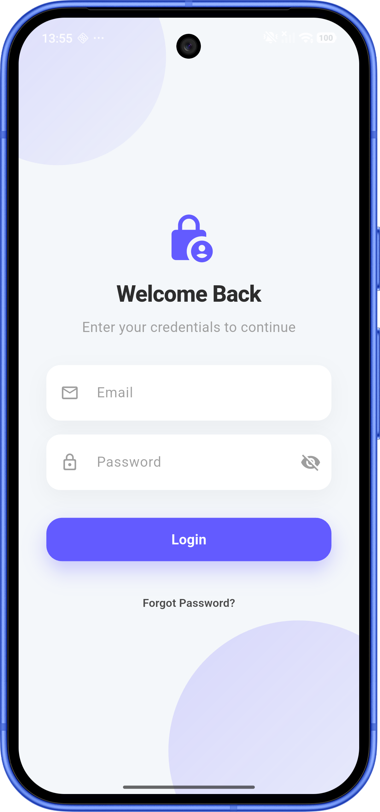 | 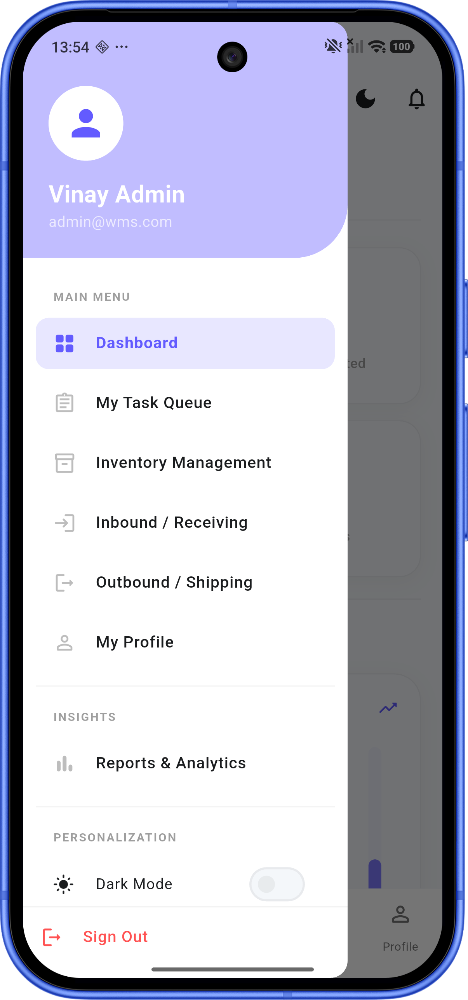 | 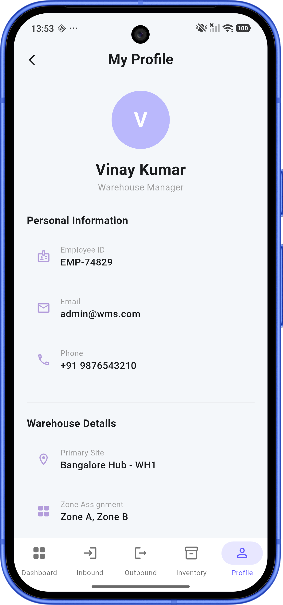 |

### 📊 Executive Dashboard & Analytics
| Real-time Dashboard | Operations Reports | Dynamic Theme Customization |
| :---: | :---: | :---: |
| 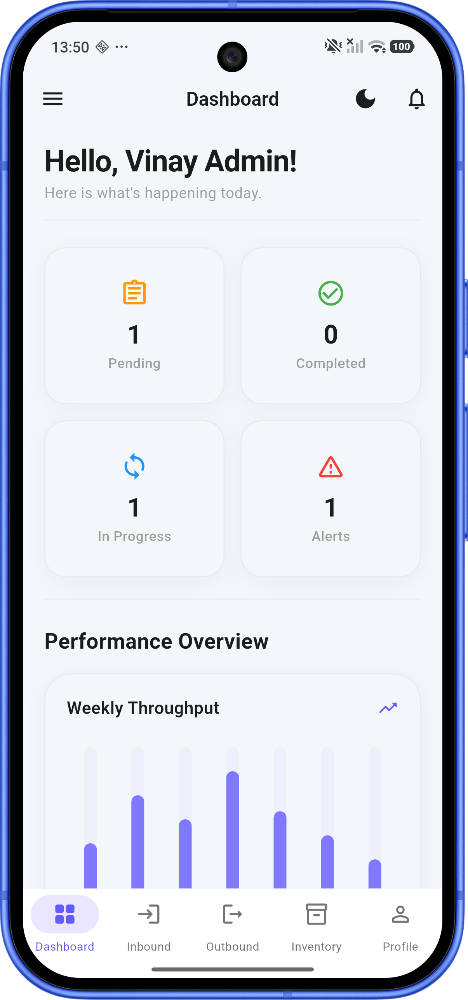 | 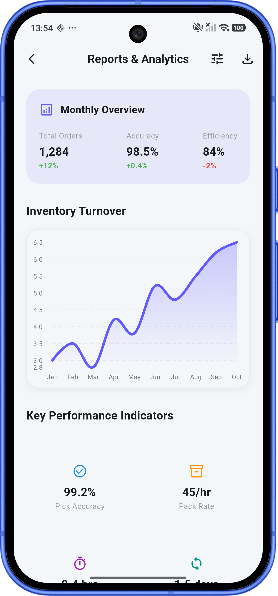 | 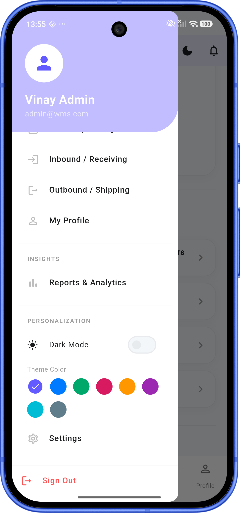 |

### 📦 Inbound & Receiving Operations
| Inbound Purchase Orders | Create Purchase Order | Barcode PO Scanning |
| :---: | :---: | :---: |
| 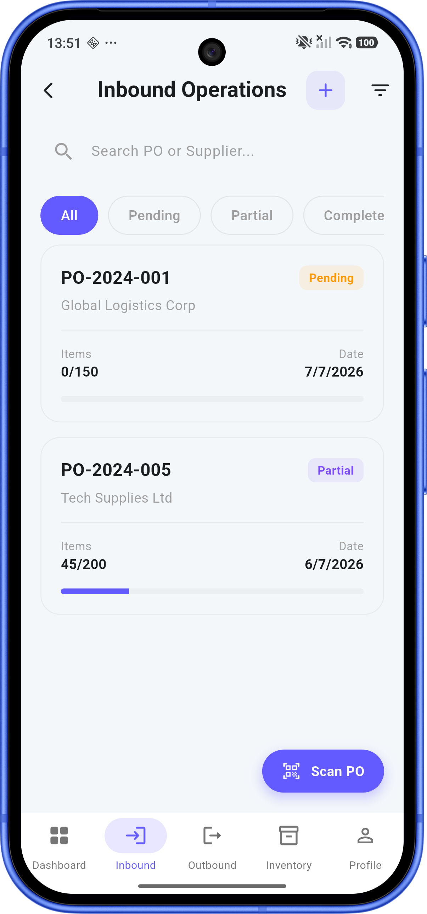 | 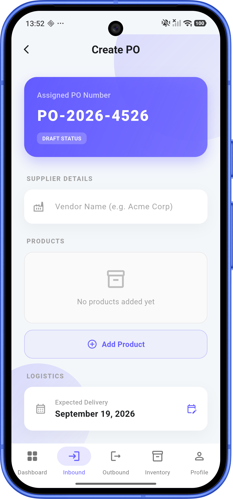 | 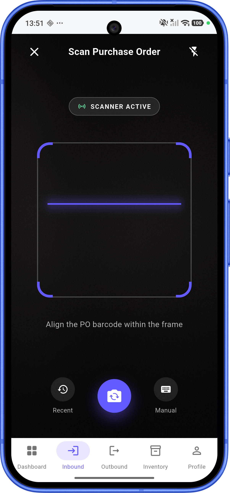 |

### 🏢 Inventory & Stock Management
| Inventory Catalog | Add / Receive Inventory Item | Warehouse Task Queue |
| :---: | :---: | :---: |
| 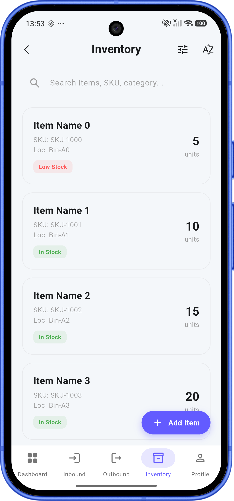 | 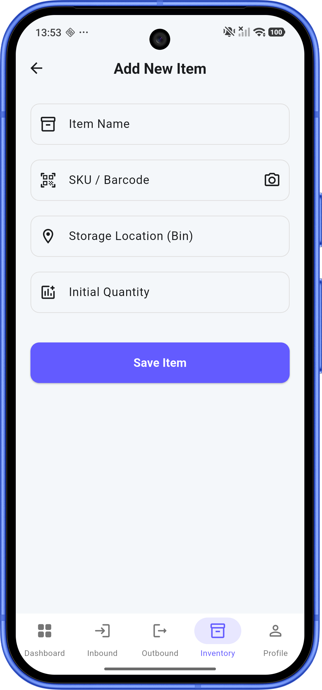 | 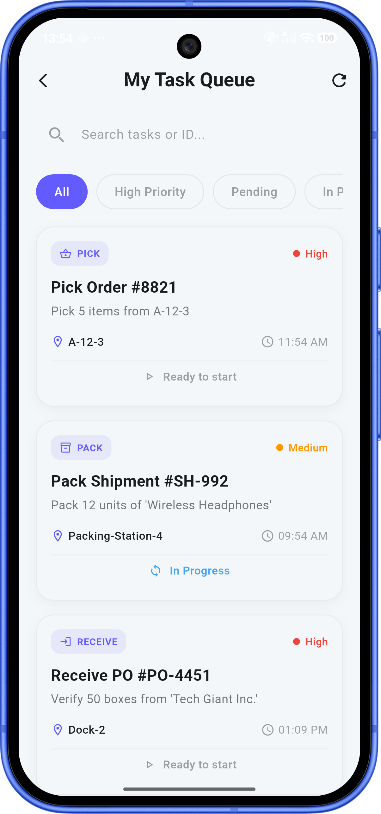 |

### 🚚 Outbound Shipping & PDF Document Export
| Outbound Shipments | Daily Shipping Manifest | PDF Invoice & Label Preview |
| :---: | :---: | :---: |
| 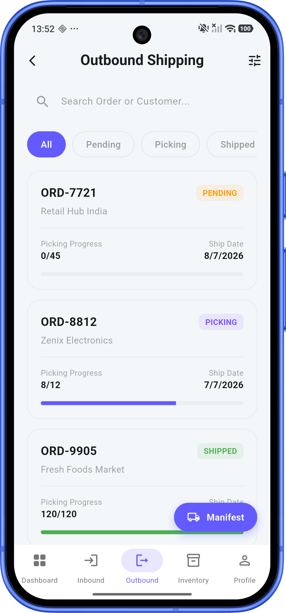 | 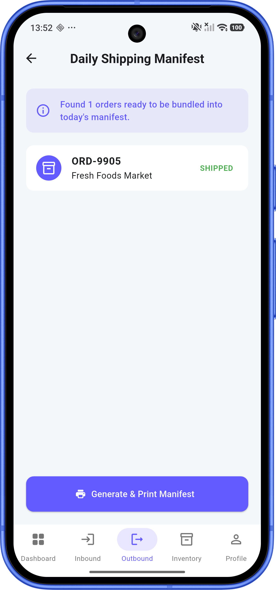 | 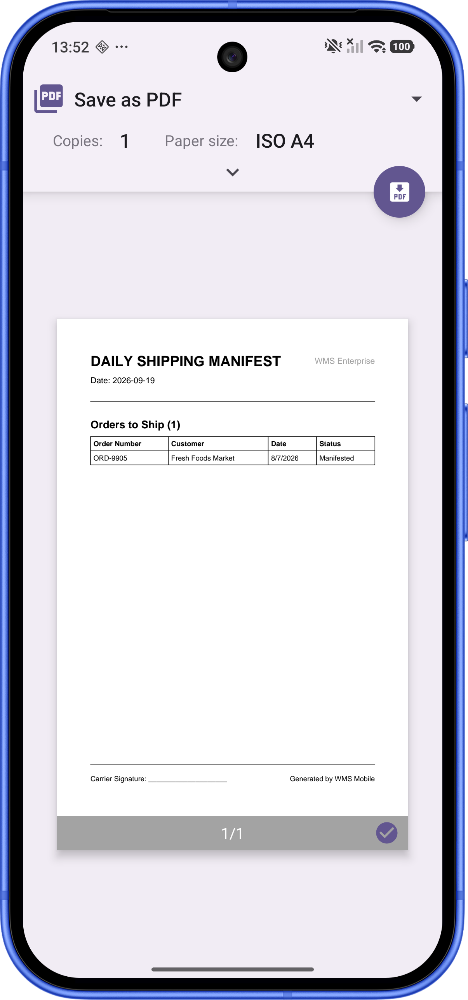 |

---

## 🌟 Key Features

### 🔐 Authentication & Session Management
* **Secure Login**: Role-based access control (Admin, Warehouse Manager, Picker, Auditor).
* **Session Persistence**: Secure token storage backed by `flutter_secure_storage`.
* **Dynamic Theming**: Instant light and dark mode toggling with adaptive color palettes.

### 📊 Business Intelligence & Reporting
* **Interactive KPI Dashboard**: Real-time metrics on pending inbound POs, outbound dispatches, low stock items, and picking efficiency.
* **Graphical Analytics**: Stock movement trends and daily performance visualization using `fl_chart`.
* **Custom Reports**: Generate actionable reports on inventory turnover, damage logs, and shipment dispatches.

### 📥 Inbound Logistics & Putaway
* **PO Receiving**: Inspect and process incoming supplier purchase orders.
* **Directed Putaway**: Smart bin location recommendations to optimize warehouse floor space.
* **Goods Receipt Note (GRN)**: Automatic GRN summary generation upon inbound completion.
* **Damage Management**: Log damaged goods during receiving with photo attachments and condition reports.

### 📦 Stock & Inventory Control
* **Live Catalog Search**: Instant search and multi-criteria filter by SKU, category, bin location, or stock level.
* **Item Stock Adjustments**: Fast stock additions, manual adjustments, and threshold stock warnings.
* **Cycle Counting & Auditing**: Physical stock verification and variance logging.

### 📤 Outbound Logistics & Fulfillment
* **Order Picking**: Automated pick lists with optimized bin navigation routes.
* **Packing & Shipping**: Dispatch order verification and courier manifest updates.
* **Daily Shipping Manifest**: Complete daily shipping records with carrier dispatch timestamps.

### 🖨 Document Generation & Barcode Scanning
* **Mobile Barcode Scanner**: Hardware camera scanning via `mobile_scanner` for rapid SKU and PO verification.
* **PDF Invoices & Shipping Labels**: On-the-fly PDF creation using `pdf` and `printing` services with thermal printer readiness.

---

## 🏗 System Architecture & Design Patterns

The application is structured following **Clean Architecture** and **Feature-First** principles combined with **MVVM** and the **Repository Pattern**.

```text
lib/
├── app/                  # Application configuration, routing, and styling
│   ├── config/           # Environment variables and app settings
│   ├── router/           # GoRouter route definitions & navigation guards
│   └── theme/            # Material 3 light/dark theme data & colors
│
├── core/                 # Shared infrastructure & utilities
│   ├── di/               # Centralized Dependency Injection (GetIt)
│   ├── error/            # Custom failures and exception handling
│   ├── network/          # Network API service layer & HTTP client abstraction
│   ├── services/         # Printing, PDF, and system level services
│   ├── storage/          # Storage contracts (Hive & Secure Storage)
│   └── utils/            # Helper utilities and extensions
│
├── features/             # Self-contained business modules
│   ├── audit/            # Stock cycle count & physical audits
│   ├── authentication/   # Login, splash, user profile & session
│   ├── barcode/          # Camera scanner & barcode handling
│   ├── dashboard/        # Home metrics, KPI cards & reporting
│   ├── inventory/        # Stock catalog, bin tracking & item creation
│   ├── inward/           # Inbound PO receiving, GRN & putaway
│   ├── purchase_order/   # Purchase order creation & vendor tracking
│   ├── returns/          # Return processing & RMA workflows
│   ├── settings/         # Theme toggles & application settings
│   ├── shipment/         # Outbound orders, picking & shipping manifests
│   └── tasks/            # Worker task assignment queue
│
└── shared/               # Reusable UI widgets, models, and dialogs
```

### 🔑 Enterprise Patterns Applied
1. **Feature-First Folder Layout**: Highly modular and decoupled feature folders containing their own Views, ViewModels, Repositories, Models, and Services.
2. **MVVM Pattern**: ViewModels manage UI state and expose clean streams/notifiers to Views using Riverpod.
3. **Repository Pattern**: Abstract domain data interfaces decouple data fetching (Network REST API / Mock Service / Local Storage) from business logic.
4. **Dependency Injection**: Centralized service locator (`GetIt`) guarantees loose coupling, effortless mocking, and single sources of truth.
5. **Storage Abstraction**: Storage contracts isolate local database implementations (Hive, Secure Storage) from feature consumption.

---

## 🛠 Tech Stack & Libraries

| Category | Technology / Library | Description |
| :--- | :--- | :--- |
| **Framework** | Flutter (Dart SDK ^3.11) | Cross-platform mobile framework |
| **State Management** | `flutter_riverpod` (^2.6.1) | Reactive state management & dependency injection |
| **Service Locator** | `get_it` (^8.0.0) | Centralized object registry & DI |
| **Navigation** | `go_router` (^14.3.0) | Declarative route management & deep linking |
| **Local Storage** | `hive_flutter` (^1.1.0) | Fast, lightweight key-value local database |
| **Secure Storage** | `flutter_secure_storage` (^9.2.2) | Encrypted storage for sensitive session tokens |
| **Networking** | `dio` (^5.5.0) & `http` (^1.6.0) | REST API client with interceptors and error handling |
| **Barcode Scanning** | `mobile_scanner` (^7.4.0) | High-performance mobile camera scanner |
| **Charts** | `fl_chart` (^1.2.0) | Customizable chart visualizations |
| **PDF & Printing** | `pdf` (^3.11.1) & `printing` (^5.13.2) | Dynamic PDF document creation and wireless printing |

---

## 🚀 Getting Started

### Prerequisites
* [Flutter SDK](https://docs.flutter.dev/get-started/install) (`>= 3.11.5`)
* [Dart SDK](https://dart.dev/get-started)
* Android Studio / VS Code with Flutter extensions
* Connected Android / iOS Device or Emulator

### Installation & Setup

1. **Clone the Repository**:
   ```bash
   git clone https://github.com/VinayTiwari023/enterprise-wms-flutter.git
   cd enterprise-wms-flutter
   ```

2. **Install Dependencies**:
   ```bash
   flutter pub get
   ```

3. **Run Code Generation** (for JSON serialization & Hive adapters):
   ```bash
   flutter pub run build_runner build --delete-conflicting-outputs
   ```

4. **Launch the Application**:
   ```bash
   flutter run
   ```

---

## 🧪 Quality Control & Testing

To maintain production standards, run static analysis and unit tests prior to commits:

```bash
# Analyze project code for lint errors and standards
flutter analyze

# Run unit and viewmodel test suites
flutter test
```

---

## 👨‍💻 Author

**Vinay Kumar**
*Flutter & Android Developer*

* 🐙 GitHub: [@VinayTiwari023](https://github.com/VinayTiwari023)
* 📦 Repository: [enterprise-wms-flutter](https://github.com/VinayTiwari023/enterprise-wms-flutter)

---

## 📄 License

This project is licensed under the **MIT License** — see the [LICENSE](LICENSE) file for details.
